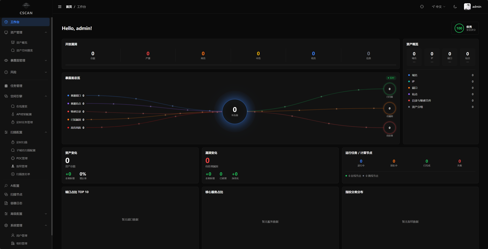
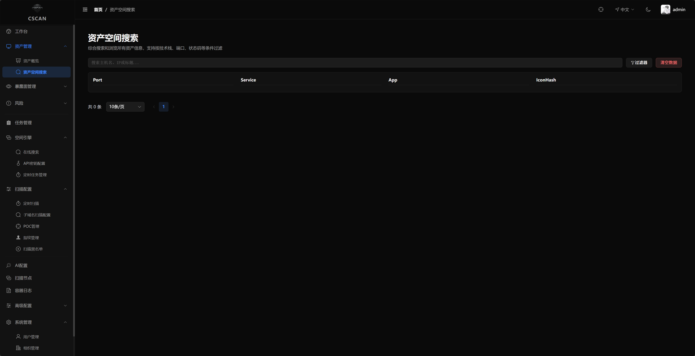

<div align="center">
  
</div>

<div align="center">

**CSCAN-企业级分布式网络资产扫描平台**

[](https://golang.org)
[](https://vuejs.org)
[](LICENSE)
[](VERSION)

[中文](README.md) · [English](README_EN.md)

</div>

---

<table width="100%">
  <tr>
    <td align="center"><b>控制台</b></td>
    <td align="center"><b>资产空间搜索</b></td>
    <td align="center"><b>指纹管理</b></td>
    <td align="center"><b>漏洞库</b></td>
    <td align="center"><b>节点监控</b></td>
    <td align="center"><b>通知订阅</b></td>
  </tr>
  <tr>
    <td align="center"></td>
    <td align="center"></td>
    <td align="center"></td>
    <td align="center"></td>
    <td align="center"></td>
    <td align="center"></td>
  </tr>
</table>

---
## 功能特性
### 核心能力

- **分布式架构** - Master/Worker 分离，支持多节点弹性扩缩容
- **流水线编排** - 扫描阶段自动串联，前序结果自动传递给后续阶段
- **弱口令字典管理** - 内置默认字典，支持自定义字典增删改查、导入导出
- **定时任务** - Cron 表达式驱动的周期性扫描任务
- **资产分组** - 按域名自动聚合资产，实时反映任务状态
- **工作空间隔离** - 数据按 workspace_id 过滤，支持组织/团队维度管理
- **通知订阅** - 扫描结果实时推送（钉钉/飞书/企业微信/邮件/Webhook）

---

## 项目结构

```
cscan/
├── api/              # HTTP API 服务（go-zero REST :8888）
├── rpc/task/         # gRPC 内部服务 (:9000)
├── worker/           # 分布式 Worker（WebSocket 长连接 + 8 阶段扫描流水线）
├── internal/         # 工程内部公共模块
│   ├── model/        # MongoDB 数据模型（全局单集合 + workspace_id 过滤）
│   ├── scanner/      # 扫描引擎（Naabu/Nmap/Httpx/Nuclei/FFuf/Chromedp）
│   ├── scheduler/    # 任务调度（Redis 队列/分块/定时/孤儿恢复/资产复验）
│   └── onlineapi/    # 在线资产搜索（FOFA/Hunter/Quake）
├── pkg/              # 公共工具包（xerr/response/executor/notify 等）
├── rules/            # 默认规则与字典（黑名单/指纹/HTTP 映射/扫描模板/弱口令）
├── web/              # Vue 3 前端（:7777）
├── docker/           # Docker 构建配置
├── scripts/          # 开发脚本
└── docker-compose*.yaml
```

## 快速开始

```bash
# 克隆项目
git clone https://github.com/tangxiaofeng7/cscan.git
cd cscan

# Linux/macOS：直接以 bash 运行即可
bash cscan.sh

# Windows
.\cscan.bat
```

> 访问 `https://ip:7777`，默认账号 `admin / 123456`
---

## 资源配置（可选）

默认配额开箱即用（API/RPC 1G、Worker 2G、Mongo 2G、Redis 512M、Web 512M），无需手动配置：
Worker 并发由容器内存上限自动推导（`worker/main.go`，384MB/标签 × 0.6），运行期再按 CPU/内存负载自适应降压，
低配机不 OOM、高配机自动吃满。

需要调整时在 `.env` 中注入（全部可配置变量见 `docker-compose.yaml` 注释）：

```bash
# .env 示例
CSCAN_WORKER_MEM_LIMIT=3G        # Worker 内存上限（默认 2G，并发随其自动推导）
CSCAN_WORKER_CPU_LIMIT=4         # Worker CPU 上限（默认 2）
CSCAN_MONGO_MEM_LIMIT=1G         # Mongo WiredTiger 缓存上限（默认 2G，低配机建议调低）
CSCAN_API_MEM_LIMIT=768M         # API 内存上限（默认 1G）
CSCAN_WORKER_CONCURRENCY=4       # 显式指定 Worker 并发（默认按内存自动推导）
```

独立 Worker 探针节点部署在目标机后，可下载 `http://<服务器>:8888/static/worker-tune.sh`
（Windows 用 `worker-tune.ps1`）自动按目标机规格生成 override 并启动。

---

## 本地开发

### 一键启动（推荐）

完整本地栈（MongoDB + Redis + RPC + API + Web + Worker）全部经 `docker-compose.dev.yaml` 容器化启动，本地代码自动构建：

```bash
# Windows PowerShell:
./scripts/dev.ps1
# Linux/macOS / Git Bash:
./scripts/dev.sh
```

启动后访问 `http://localhost:7777`，默认账号 `admin / 123456`。

> - Worker 随栈自动启动，默认使用内置密钥（可用环境变量 `CSCAN_WORKER_KEY` 覆盖），无需手动配置；
> - 代码变更后重新运行脚本即可自动重新构建对应镜像；
> - 查看日志：`docker-compose -f docker-compose.dev.yaml logs -f`；停止：`docker-compose -f docker-compose.dev.yaml down`；
> - 仅调试单个服务（如仅调试 API）：`docker-compose -f docker-compose.dev.yaml up -d --build cscan-api`。
---

## License

MIT
